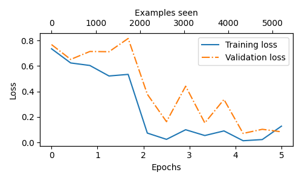

# GPT From Scratch

This project documents the journey of building, pre-training, and fine-tuning a GPT-style Transformer model from the ground up using PyTorch. The goal was to gain a first-principles understanding of modern language model architectures, moving beyond high-level library calls.

The implementation is based on the GPT-2 (124M parameter) architecture and is divided into two main parts:
1.  **Generative Pre-Training**: Training the base model to perform text completion on a custom corpus.
2.  **Classification Fine-Tuning**: Adapting the pre-trained model for a specific downstream task—spam detection.

The primary learning resources for this project were the book **"Build a Large Language Model from Scratch"** by Sebastian Raschka and the **Vizuara "LLM from Scratch"** YouTube playlist.

## Key Features

* **From-Scratch Architecture**: All core components, including `Multi-Head Causal Self-Attention`, `Transformer Blocks`, and `LayerNorm`, are implemented from the ground up.
* **Generative Pre-Training**: The `train.py` script can train the model for text completion on any `.txt` file.
* **Pre-trained Weight Loading**: Includes a utility to download and load the official GPT-2 (124M) weights from Hugging Face into the custom model architecture.
* **Parameter-Efficient Fine-Tuning (PEFT)**: The model is fine-tuned for spam classification by freezing most of the pre-trained layers and only training the final transformer block and a new classification head.
* **Flexible Text Generation & Inference**: Dedicated scripts to generate free-form text and classify new messages as spam or ham.
* **Training Visualization**: Automatically generates plots for loss and accuracy curves during training.

## Project Structure

The project is organized into a modular and reusable structure:

```
gpt-from-scratch/
|
├── data/                       # For storing datasets (e.g., train.csv, val.csv)
├── checkpoints/                # Directory for saved model checkpoints
├── training_results/           # Directory for saved loss and accuracy plots
|
├── model.py                    # Contains all nn.Module classes (GPTModel, GPTSpamClassification)
├── dataloader.py               # Data loading logic (GPTDataset, SpamDataset)
├── utils.py                    # Helper functions (generation, weight loading, config)
├── spam_data.py                # Script to download and process the spam dataset
├── train.py                    # Main script for both pre-training and fine-tuning
├── verify_keys.py              # Script to verify OurModel vs GPT-2 124M model keys
├── generate_text.py            # Script for running generative inference
├── spam_ham_classifier.py      # Script for running classification inference
|
├── OurModel_vs_GPT-2-124M.txt  # Model key comparison results
├── requirements.txt            # Project dependencies
└── README.md                   # This file
```

## Part 1: Generative Pre-Training

This phase focuses on training the base GPT model for text completion.

### Setup and Usage

1.  **Setup Environment**:
    ```bash
    # Create and activate a virtual environment
    uv venv
    source .venv/bin/activate

    # Install dependencies
    uv pip install -r requirements.txt
    ```

2.  **Training from Scratch**:
    To train the model on a custom text file (e.g., `the-verdict.txt`):
    ```bash
    python train.py --file_path "data/the-verdict.txt" --num_epochs 10
    ```

3.  **Generating Text**:
    * **From your trained checkpoint:**
        ```bash
        python generate_text.py --prompt "The sun is bright outside"
        ```
    * **From pre-trained GPT-2 (124M) weights:**
        ```bash
        python generate_text.py --from_pretrained --prompt "The future of artificial intelligence is"
        ```

### Example Generative Results

> **Prompt:** "Let us go to"
>
> **Reply (trained from scratch on "the-verdict.txt"):**
> ```
> Let us go to see terr what one of the axi," he had been with that pointed?"
>
> He I blocked the you like to face back his window-curtains, with paint was, years down it were is the first
> ```
>
> **Reply (using pre-trained GPT-2 weights):**
> ```
> Let us go to the previous page to see the actual example (and then add a reference to the file). In your own program (such as a program where a variable name is supplied) there's an easy way: you can use any program for that.
> ```

---

## Part 2: Classification Fine-Tuning (Spam Detection)

This phase adapts the pre-trained GPT-2 model to classify SMS messages as "Spam" or "Ham."

### Methodology

The model is fine-tuned using a **parameter-efficient** approach:
* The majority of the pre-trained GPT-2 layers are **frozen**.
* Only the **final Transformer block** and the final `LayerNorm` layer are unfrozen and trained.
* The original text-generation head is replaced with a new **classification head** (a simple `nn.Linear` layer) which is trained from scratch.
* For this classification task, the **causal attention mask** is disabled to allow the model to use bi-directional context, which is crucial for understanding the entire message.

### Setup and Usage

1.  **Prepare the Dataset**:
    The project uses the **SMS Spam Collection Dataset** from the UCI Machine Learning Repository. The `prepare_data.py` script automates downloading, cleaning (lowercasing), balancing, and splitting the data into 70% train, 10% validation, and 20% test sets.
    ```bash
    # Run this script once to create the data/train.csv, data/validation.csv, and data/test.csv files
    python spam_data.py
    ```

2.  **Fine-Tuning**:
    Run the training script with the `--classification` flag. This will load the pre-trained GPT-2 weights, apply the freezing strategy, and fine-tune the model on the spam dataset.
    ```bash
    python train.py --classification --num_epochs 5
    ```

3.  **Evaluation & Custom Prediction**:
    The `train.py` script automatically evaluates the final model on the test set after training is complete. To classify a custom message, use the `spam_ham_classifier.py` script.
    #### Example for a Spam message
    ```bash
    python3 spam_ham_classifier.py --text "You are a winner you have been specially selected to receive $1000 cash or a $2000 award."
    ```
    **Prompt:**  
    `You are a winner you have been specially selected to receive $1000 cash or a $2000 award.`

    **Prediction:**  
    `Spam`

    #### Example for a Ham message
    ```bash
    python3 spam_ham_classifier.py --text "Hey, just wanted to check if we're still on for dinner tonight? Let me know."
    ```
    **Prompt:**  
    `Hey, just wanted to check if we're still on for dinner tonight? Let me know.`

    **Prediction:**  
    `Ham`

### Fine-Tuning Results

After fine-tuning with a stable learning rate (`1e-4`), the model achieved a **Final Test Accuracy of 95.33%**.

The training process can be visualized with the following loss and accuracy plots, which are automatically saved in the `training_results/` directory.

| Loss and Accuracy Curves |
|:--------------------------:|
|       |
|  |

An interesting finding during testing was the model's limitation due to **domain mismatch**. While it performed well on the test set, it initially failed on custom spam messages with vocabulary (e.g., "rupees", "bank details") not present in the fine-tuning SMS dataset. This highlights the importance of having a diverse fine-tuning dataset that matches the target domain.
### Wrong Prediction Example

Here is an example where the model misclassifies a custom spam message due to domain mismatch:

```bash
python3 spam_ham_classifier.py --text "You have won 500 rupees, send me your bank details"
```

**Prompt:**  
`You have won 500 rupees, send me your bank details`

**Prediction:**  
`Ham`

## References and Acknowledgements

* **Primary Resource**: [Build a Large Language Model from Scratch](https://www.manning.com/books/build-a-large-language-model-from-scratch) by Sebastian Raschka.
* **Video Guide**: [Vizuara - "LLM from Scratch" YouTube Playlist](https://www.youtube.com/playlist?list=PLPTV0NXA_ZSgsLAr8YCgCwhPIJNNtexWu).
* **Additional Resource**: Andrej Karpathy's [nanoGPT](https://github.com/karpathy/nanoGPT).