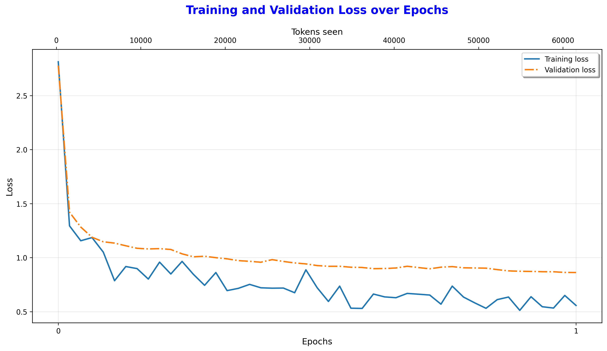

# GPT-2 From Scratch

[](https://github.com/soumitra1854/gpt-2-from-scratch/blob/main/LICENSE)
[](https://www.python.org/downloads/)
[](https://pytorch.org/)
[](https://github.com/psf/black)

This project demonstrates the journey of building, pre-training, and fine-tuning a GPT-2 model from the ground up using PyTorch. The goal is to gain a first-principles understanding of modern Large Language Model (LLM) architectures, moving beyond high-level abstractions provided by tools like LangChain, Hugging Face Transformers, OpenAI's API, etc.

This implementation is a replication of the GPT-2 (124M parameters) architecture and is divided into two main parts:
1.  **Generative Pre-Training**: Building the base model and training it for text completion on a custom corpus.
2.  **Fine-Tuning**: Fine-tuning the foundational GPT-2 (124M) model for specific downstream tasks. Two different fine-tuning techniques are used:
    * **Classification Fine-Tuning**: Adapting the pre-trained model for a specific downstream task—spam detection—and deploying it as a web app.
    * **Instruction Fine-Tuning**: Training the model to follow specific instructions or prompts more effectively.

The primary learning resources for this project are the book **"Build a Large Language Model from Scratch"** by Sebastian Raschka and the **Vizuara - "Building LLMs from scratch"** YouTube playlist.

## Key Features

* **From-Scratch Architecture**: All core components, including `LayerNorm`, `Multi-Head Causal Self-Attention`, `Transformer Blocks`, and `GPTModel` are implemented from the ground up.
* **Generative Pre-Training**: The `train.py` script can train the custom model for text generation on any custom `.txt` file.
* **Pre-trained Weight Loading**: Includes a utility to download and load the official GPT-2 (124M) weights from Hugging Face into the custom model architecture.
* **Multiple Fine-Tuning Pipelines**: A unified `fine_tune.py` script to handle two distinct fine-tuning modes:
    * **Classification Fine-Tuning**: Adapts the model for spam detection using a *parameter-efficient fine-tuning (PEFT)* approach.
    * **Instruction Fine-Tuning**: Fine-tunes the model on an instruction-response dataset.
* **Interactive Web Applications**: Two Flask-based web apps to demonstrate the models' capabilities:
    * **ChatGPT-like Interface**: A conversational chatbot for interacting with both the custom and OpenAI GPT-2 weights-based models.
    * **Spam Classifier App**: A real-time interface for classifying SMS messages as spam or ham.

## Project Structure

The project is organized into a modular and reusable structure:

```
gpt-2-from-scratch/
|
├── data/                       # For storing datasets (e.g., *.csv, *.json, *.txt files)
├── checkpoints/                # For saved model checkpoints
├── training_results/           # For saved loss and accuracy plots
├── templates/*.html            # For HTML templates
├── images/                     # Screenshots of Web Apps
|
├── model.py                    # Contains all nn.Module classes (GPTModel, GPTSpamClassification)
├── dataloader.py               # Data loading logic (GPTDataset, SpamDataset, InstructionDataset)
├── utils.py                    # Helper functions (generation, weight loading, configs)
├── spam_data.py                # Script to prepare the spam dataset
├── instruction_data.py         # Script to prepare the instruction dataset
├── train.py                    # Script for generative pre-training from scratch
├── fine_tune.py                # Script for fine-tuning (both instruction and classification)
├── verify_keys.py              # Script to verify OurModel vs GPT-2 124M model keys
├── chatgpt2.py                 # Script for running generative inference
├── spam_ham_classifier.py      # Script for running classification inference
├── chatgpt2_app.py             # Flask web app for the chatbot
├── spam_classifier_app.py      # Flask web app for the spam classifier
|
├── OurModel_vs_GPT-2-124M.txt  # Model key comparison results
├── requirements.txt            # Project dependencies
└── README.md                   # This file
```

## Setup

First, clone this repository and set up the Python environment. Make sure you have Python installed in your system. Also, install the `uv` command-line tool (uv is a Rust-based virtual environment manager):

```bash
# Clone this repository
git clone https://github.com/soumitra1854/gpt-2-from-scratch
cd gpt-2-from-scratch

# Create and activate a virtual environment
uv venv
source .venv/bin/activate

# Install the required packages
uv pip install -r requirements.txt
```

## Part 1: Generative Pre-Training

This phase focuses on training the custom GPT-2 124M model for text generation.

1.  **Training from Scratch**:
    To train the model on a custom text file (e.g., `the-verdict.txt`):
    ```bash
    python3 train.py --file_path "data/the-verdict.txt" --num_epochs 10
    ```

2.  **Generating Text**:
    * **From your trained checkpoint:**
        ```bash
        python3 chatgpt2.py --model_path "checkpoints/trained_model_model_only.pth"
        ``` 
    * **From pre-trained GPT-2 (124M) weights:**
        ```bash
        python3 chatgpt2.py --openai_gpt2
        ```
        When prompted, enter a text prompt to generate a response e.g., "*The future of artificial intelligence is*".

3.  **Interacting with the Chatbot Web App**:
    ```bash
    python3 chatgpt2_app.py
    ```
    Open your browser and navigate to `http://localhost:5000`.

    

### Pre-Training Results


#### Example Prompt and Models' Replies

> **Prompt:**  
> `The future of artificial intelligence is`

**Reply (Custom GPT-2 trained from scratch on "the-verdict.txt"):**
```
The future of artificial intelligence is to go a little wild--I looked at every. And so charming, her--and by me!" I looked up theit was back his head to look up at the honour being _mine_--oh, but his painting.
```
**Reply (Custom Model with Pre-trained OpenAI GPT-2 124M weights):**
```
The future of artificial intelligence is in the open. A lot of people are looking into it. But I think it's very important that we do the right thing for the future. I think that we're going to have to make sure we keep the same level of sophistication and intelligence
```
It is evident from the above examples that the model's ability to generate coherent and contextually relevant text improves significantly when leveraging the pre-trained weights of GPT-2. This highlights the importance of large-scale pre-training on diverse, internet-scale datasets.

## Part 2: Classification Fine-Tuning (Spam Detection)

This phase adapts the pre-trained GPT-2 model to classify SMS messages as "Spam" or "Ham."

### Methodology

The model is fine-tuned using a **parameter-efficient** approach:
* The majority of the pre-trained GPT-2 layers are **frozen**.
* Only the **final Transformer block** and the final `LayerNorm` layer are unfrozen and trained.
* The original text-generation head is replaced with a new **classification head** (a simple `nn.Linear` layer) which is trained from scratch.
* For this classification task, the **causal attention mask** is disabled to allow the model to use bi-directional context, which is crucial for understanding the entire message.

### Setup and Usage

1.  **Prepare the Dataset**:
    The project uses the **SMS Spam Collection Dataset** from the UCI Machine Learning Repository. The `prepare_data.py` script automates downloading, cleaning (lowercasing), balancing, and splitting the data into 70% train, 10% validation, and 20% test sets.
    ```bash
    # Run this script once to create the data/train.csv, data/validation.csv, and data/test.csv files
    python3 spam_data.py
    ```

2.  **Fine-Tuning**:
    Run the fine-tuning script with the `--classification_ft` flag. This will load the pre-trained GPT-2 weights, apply the freezing strategy, and fine-tune the model on the spam dataset.
    ```bash
    python3 fine_tune.py --classification_ft --num_epochs 5
    ```

3.  **Evaluation & Custom Prediction**:
    The `fine_tune.py` script automatically evaluates the final model on the test set after training is complete. To classify custom messages, use the `spam_ham_classifier.py` script.
    #### Example messages
    ```bash
    python3 spam_ham_classifier.py

    Enter message: You are a winner you have been specially selected to receive $1000 cash or a $2000 award.

    🚫 Classification: Spam

    Enter message: Hey, just wanted to check if we're still on for dinner tonight? Let me know.

    ✅ Classification: Ham
    ```
4.  **Interactive Classifier Web App**:
    ```bash
    python3 spam_classifier_app.py
    ```
    Open your browser and navigate to `http://localhost:5001`.

    

### Fine-Tuning Results

After fine-tuning with a stable learning rate (`1e-4`), the model achieved a **Test Accuracy of 95.33%**.
The training process can be visualized with the following loss and accuracy plots, which are automatically saved in the `training_results/` directory.

|                               Loss and Accuracy Curves                                |
| :-----------------------------------------------------------------------------------: |
|          |
|  |

### Limitations
An interesting finding during testing was the model's limitation due to **domain mismatch**. While it performed well on the test set, it initially failed on custom spam messages with vocabulary (e.g., "rupees", "bank details") not present in the fine-tuning SMS dataset. This highlights the importance of having a diverse fine-tuning dataset that matches the target domain.
#### Wrong Prediction Example

Here is an example where the model misclassifies a custom spam message due to domain mismatch:

```bash
python3 spam_ham_classifier.py
Enter message: You have won 500 rupees, send me your bank details

✅ Classification: Ham
```
## Part 3: Instruction Fine-Tuning
This final phase adapts the pre-trained GPT-2 model to follow instructions and act as a basic conversational agent.

### Methodology
* This task uses **full fine-tuning**, where all 124 million parameters of the pre-trained GPT-2 model are unfrozen and trained on a new instruction-response dataset. 
* A custom PyTorch `custom_collate_fn` was implemented to handle variable-length sequences and apply loss masking. This ensures the model is only penalized for errors in its generated response, not for the meaningless padding tokens, focusing the learning process on instruction-following behavior.

### Setup and Usage
1. **Prepare the Dataset**:
The `instruction_data.py` script downloads and splits the instruction-response dataset into training (85%), validation (5%), and test (10%) sets.
    ```bash
    python3 instruction_data.py
    ```
2.  **Fine-Tuning**: Run the fine-tuning script with the `--instruction_ft` flag. This will load the pre-trained GPT-2 weights and fine-tune the model on the instruction-response dataset.
    ```bash
    # Note: This is memory intensive. A small batch size is recommended for consumer GPUs.
    python3 fine_tune.py --instruction_ft --num_epochs 1 --eval_freq 5 --batch_size 4
    ```
### Fine-Tuning Results
After just one epoch of fine-tuning, the model showed a significant improvement in its ability to follow instructions. The training and validation loss steadily decreased, indicating that the model was effectively learning from the new dataset.



### Example Evaluations
Here are some sample responses from the instruction-tuned model, demonstrating its improved capabilities and limitations:

#### Sample Instruction Evaluations

**Example 1:**
```
Input: Rewrite the sentence using a simile.
Sentence: The car is very fast.

Generated Response: The car is as fast as a hot water pole.
```

**Example 2:**
```
Input: Correct the punctuation in the sentence.
Sentence: Its time to go home.

Generated Response: It is time to go home.
```

**Example 3:**
```
Input: Create a sentence using the word 'nostalgia'.

Generated Response: He has relived the memories of his past life.
```

The model demonstrates mixed results: while it successfully corrects punctuation and attempts creative responses, some outputs (like "hot water pole" for a speed simile) show the limitations of the current fine-tuning approach and the need for more extensive training data.

## References and Acknowledgements

* **Primary Resource**: [Build a Large Language Model from Scratch](https://www.manning.com/books/build-a-large-language-model-from-scratch) by Sebastian Raschka.
* **Video Guide**: [Vizuara - "Building LLMs from scratch" YouTube Playlist](https://www.youtube.com/playlist?list=PLPTV0NXA_ZSgsLAr8YCgCwhPIJNNtexWu).
* **Additional Resource**: Andrej Karpathy's [nanoGPT](https://github.com/karpathy/nanoGPT).