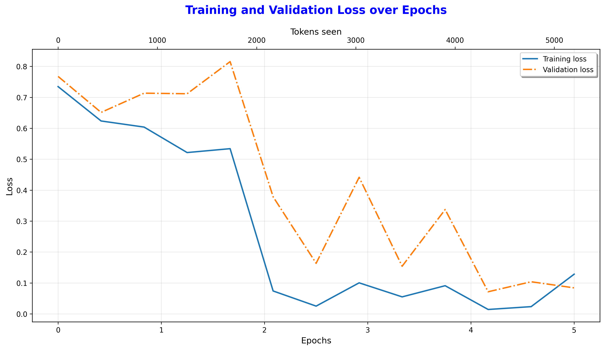
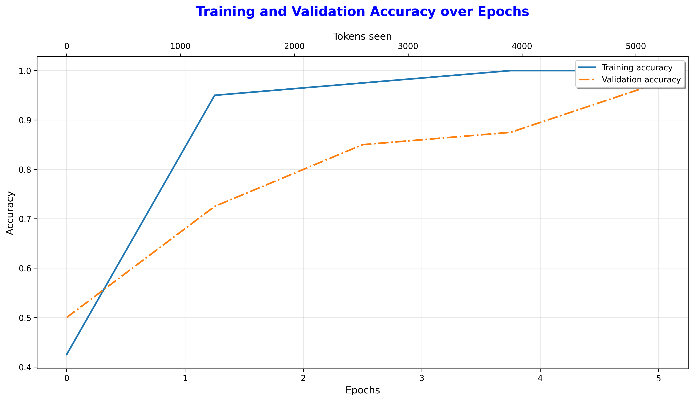

# GPT-2 From Scratch: Pre-Training and Fine-Tuning

This project documents the journey of building, pre-training, and fine-tuning a GPT-2 model from the ground up using PyTorch. The goal is to gain a first-principles understanding of modern Large Language Model (LLM) architectures, moving beyond high-level abstractions provided by tools like Hugging Face Transformers.

This implementation is a replication of the GPT-2 (124M parameters) architecture and is divided into three main parts:
1.  **Generative Pre-Training**: Building the base model and training it for text completion on a custom corpus.
2.  **Classification Fine-Tuning**: Adapting the pre-trained model for a specific downstream task—spam detection—and deploying it as a web app.
3.  **Instruction Fine-Tuning**: Further fine-tuning the model to follow specific instructions, turning it into a basic conversational agent, also deployed as a web app.

The primary learning resources for this project are the book **"Build a Large Language Model from Scratch"** by Sebastian Raschka and the **Vizuara - "Building LLMs from scratch"** YouTube playlist.

## Key Features

* **From-Scratch Architecture**: All core components, including `LayerNorm`, `Multi-Head Causal Self-Attention`, `Transformer Blocks`, and the `GPTModel` are implemented from the ground up.
* **Pre-trained Weight Loading**: Includes a utility to download and load the official GPT-2 (124M) weights from Hugging Face into the custom model architecture.
* **Multiple Training Pipelines**: A unified `fine_tune.py` script to handle three distinct training modes:
    * **Generative Pre-Training**: Trains the base model for text completion.
    * **Classification Fine-Tuning**: Adapts the model for spam detection using a parameter-efficient approach.
    * **Instruction Fine-Tuning**: Fine-tunes the model on an instruction-response dataset.
* **Interactive Web Applications**: Two Flask-based web apps to demonstrate the model's capabilities:
    * **Spam Classifier App**: A real-time interface to classify SMS messages as spam or ham.
    * **ChatGPT-like Interface**: A conversational UI to interact with the instruction-tuned model.

## Project Structure

The project is organized into a modular and reusable structure:

```
gpt-from-scratch/
|
├── data/                 # For storing datasets (e.g., train.csv, instruction_train.json)
├── checkpoints/          # For saved model checkpoints
├── training_results/     # For saved loss and accuracy plots
|
├── model.py              # Contains all nn.Module classes (GPTModel, GPTSpamClassification)
├── dataloader.py         # Data loading logic for all tasks
├── utils.py              # Helper functions (generation, weight loading, configs)
├── spam_data.py          # Script to prepare the spam dataset
├── instruction_data.py   # Script to prepare the instruction dataset
├── fine_tune.py          # Main script for all training and fine-tuning tasks
├── train.py              # Script for generative pre-training from scratch
├── chatgpt2_app.py       # Flask web app for the chatbot
├── spam_classifier_app.py# Flask web app for the spam classifier
|
├── requirements.txt      # Project dependencies
└── README.md             # This file
```

## Setup and Usage

### 1. Setup

First, clone the repository and set up the Python environment.

```bash
# Clone the repository
git clone <your-repo-url>
cd gpt-from-scratch

# Create and activate a virtual environment
python -m venv .venv
source .venv/bin/activate

# Install the required packages
pip install -r requirements.txt
```

### 2. Generative Pre-Training (From Scratch)

To train the model for text completion on a custom text file (e.g., `the-verdict.txt`):

```bash
# Place the-verdict.txt in the data/ directory
python train.py
```
This will train the model and save the final checkpoint and loss plot.

### 3. Classification Fine-Tuning (Spam Detection)

This fine-tunes the pre-trained GPT-2 model to classify SMS messages.

**1. Prepare the Dataset:**
The `spam_data.py` script automates downloading, cleaning, balancing, and splitting the data.
```bash
# Run this script once to create the data/train.csv, etc.
python spam_data.py
```

**2. Run Fine-Tuning:**
This will load the pre-trained GPT-2 weights and fine-tune them on the spam dataset.
```bash
python fine_tune.py --classification_ft --num_epochs 5
```

**3. Launch the Web App:**
```bash
python spam_classifier_app.py
```
Navigate to `http://localhost:5001` to use the spam classifier.

### 4. Instruction Fine-Tuning

This fine-tunes the pre-trained GPT-2 model to follow instructions.

**1. Prepare the Dataset:**
The `instruction_data.py` script downloads and splits the instruction-response dataset.
```bash
# Run this script once to create the instruction JSON files in data/
python instruction_data.py
```

**2. Run Fine-Tuning:**
This will fine-tune the GPT-2 124M model on the instruction dataset.
```bash
# Note: This is memory intensive. Use a small batch size.
python fine_tune.py --instruction_ft --batch_size 1 --num_epochs 1
```

**3. Launch the Chatbot Web App:**
```bash
python chatgpt2_app.py
```
Navigate to `http://localhost:5000` to chat with the model.

## Results and Analysis

### Spam Classification

After fine-tuning with a stable learning rate (`1e-4`), the spam classification model achieved a **Final Test Accuracy of 95.33%**.

The training process can be visualized with the following loss and accuracy plots:

| Loss and Accuracy Curves                                         |
| :---------------------------------------------------------------: |
|                 |
|         |

An interesting finding was the model's limitation due to **domain mismatch**. While performing well on the test set, it initially failed on custom spam messages with vocabulary (e.g., "rupees") not present in the fine-tuning SMS dataset, highlighting the importance of a diverse fine-tuning dataset.

### Instruction Fine-Tuning

The 124M parameter model was successfully fine-tuned to follow simple instructions. It showed a clear improvement in generating structured responses compared to the base model.

**Example Evaluation:**
> **Instruction:** Rewrite the sentence using a simile. `The car is very fast.`
>
> **Model Response:** `The car is as fast as a hot water pole.`

This response demonstrates the model's ability to understand the instruction's intent (create a simile) but also highlights the limitations and creative quirks of a smaller model.

## References and Acknowledgements

* **Primary Resource**: [Build a Large Language Model from Scratch](https://www.manning.com/books/build-a-large-language-model-from-scratch) by Sebastian Raschka.
* **Video Guide**: [Vizuara - "Building LLMs from scratch" YouTube Playlist](http://googleusercontent.com/youtube/com/3).
* **Additional Resource**: Andrej Karpathy's [nanoGPT](https://github.com/karpathy/nanoGPT).